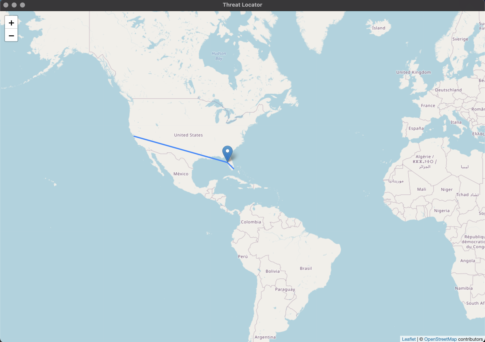

# Threat Locator

An [Electron](https://www.electronjs.org) app that streams `netstat` output into a map displaying all current connections.

## To Do
- use a continuous file stream from `netstat` rather than a interval based updating
